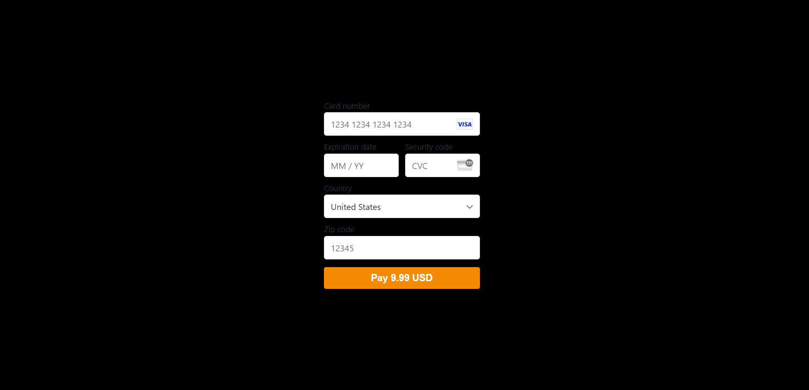

# Stripe Demo 

## Table of Contents
* [Description](#description)
* [Installation](#installation)
* [Usage](#usage)
* [Questions](#questions)

## Description
Boilerplate code for using Stripe with a NextJS application.

## Installation
After cloning the repository, run 'npm i' in both the server and client folders.

## Usage
From the server folder, run 'npm run dev' to start the client and server. 

The env files in the server and client folders will need to be renamed '.env' and provided keys for the application to work properly.

## Questions
Follow me on [Github](https://github.com/Kayvonk).

To contact me, send an email to kayvonk@gmail.com with your name and inquiry.